# Visualizing Employee Attrition at IBM

**Dataset:** [IBM HR Analytics Employee Attrition & Performance](https://www.kaggle.com/datasets/pavansubhasht/ibm-hr-analytics-attrition-dataset) — 1,470 employees, 35 columns. Synthetic data created by IBM data scientists.

**Stack:** matplotlib, seaborn, pandas plotting (`parallel_coordinates`), SciPy (dendrograms)

---

## 1. Exploration — Small Multiples

A programmatically generated 5×2 subplot grid renders every categorical feature at once, with the loop pairing each axis to a column via `zip(axes.flatten(), cat_cols)`. Categories are sorted by frequency so the shape of each distribution reads consistently across panels.

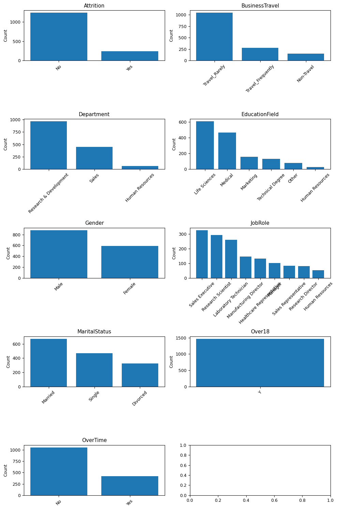

This one figure replaces nine separate calls and surfaces the two features that would later be dropped — `Over18` and `StandardHours` were visibly single-valued. It also exposes the class imbalance in `Attrition` (16.1% Yes) that drives the modeling decision in section 8.

**Technique:** subplot grids, programmatic axis assignment, frequency-ordered categoricals.

---

## 2. Diagnostics — Correlation Heatmap

Before clustering, an annotated correlation matrix on the standardized features checks for redundancy.

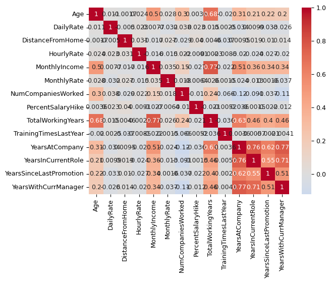

The tenure cluster (`YearsAtCompany` / `YearsWithCurrManager` / `YearsInCurrentRole`, 0.71–0.77) is immediately visible, sitting just under the 0.8 threshold and documented as a watch item rather than acted on.

**Technique:** annotated heatmaps, diverging colormaps, `center=0` for signed data.

---

## 3. Structure — Truncated Dendrograms

Hierarchical clustering on 1,470 employees produces a dendrogram far too dense to read. A reusable `plot_dendrogram(df, method, color_threshold)` function handles this by truncating to the last *p* merged clusters, annotating each node with its distance, and printing member counts in parentheses on the leaves.

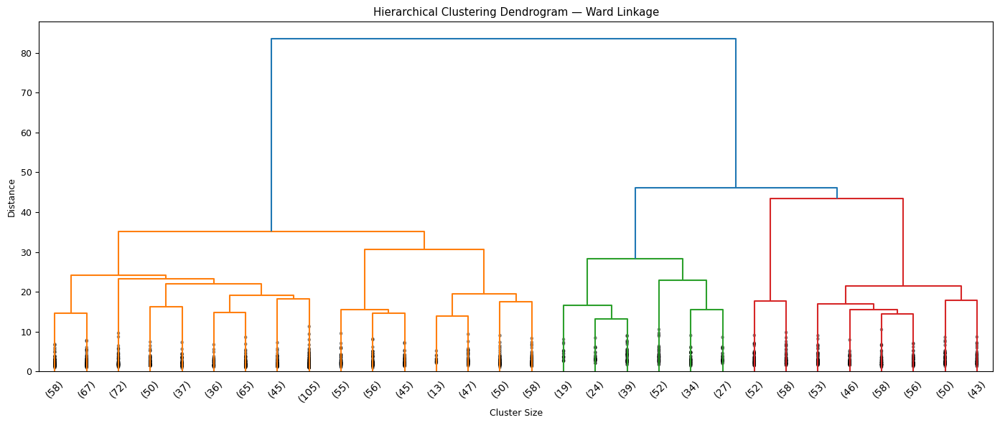

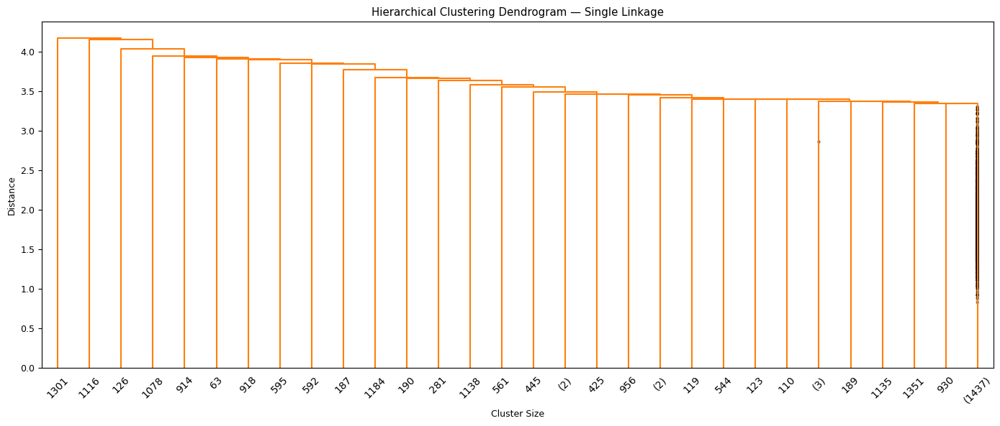

Single linkage (above) shows the textbook chaining failure — a long spine with individual employees peeling off, no meaningful group structure. Centroid and Median failed the same way. Ward and Complete were the only two producing balanced, cleanly nested branches.

**Technique:** parameterized plotting functions, truncation for high-*n* dendrograms, distance annotation, comparative small-multiple analysis across method variants.

---

## 4. Validation — Clustered Heatmap

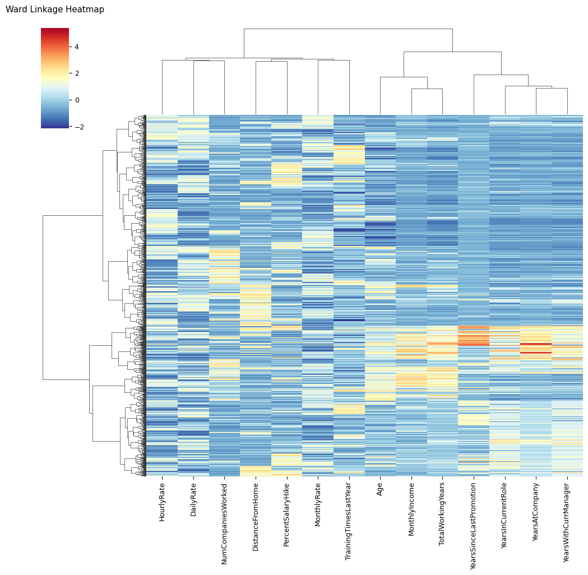

This is the figure that settled the linkage choice. Silhouette scores were nearly tied and slightly favored Complete (0.1210 vs. Ward's 0.1153), but the clustermap shows Ward producing visibly cleaner horizontal banding across age, tenure, and income. Choosing the method on visual separation over a marginally better metric is the substantive judgment call in the project.

**Technique:** `sns.clustermap`, cluster-labeled axes, reading structure the summary statistic misses.

---

## 5. Interpretation — Centroid Heatmap and Parallel Coordinates

Two views of the same three centroids.

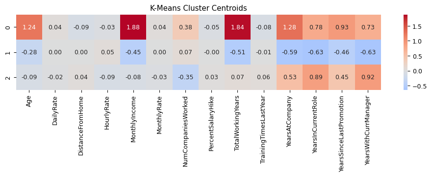

The heatmap answers *"is this cluster high or low on this feature?"* — annotated z-scores on a diverging scale, scannable per cell.

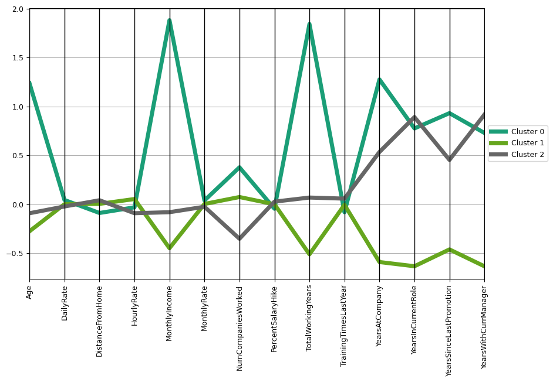

The parallel coordinates plot answers *"where do the clusters actually separate?"* — following the three lines shows them running nearly flat and overlapping across `DailyRate`, `HourlyRate`, and `MonthlyRate`, then fanning sharply apart at `MonthlyIncome`, `TotalWorkingYears`, and the tenure variables. The features that define the segments are visually obvious.

This is what converted anonymous cluster IDs into the **Junior / Mid-Career / Senior** labels used throughout the rest of the analysis.

**Technique:** `pandas.plotting.parallel_coordinates`, paired complementary encodings of one dataset, standardized values to make disparate units comparable on a shared axis.

---

## 6. Parameter Selection — Elbow Plot

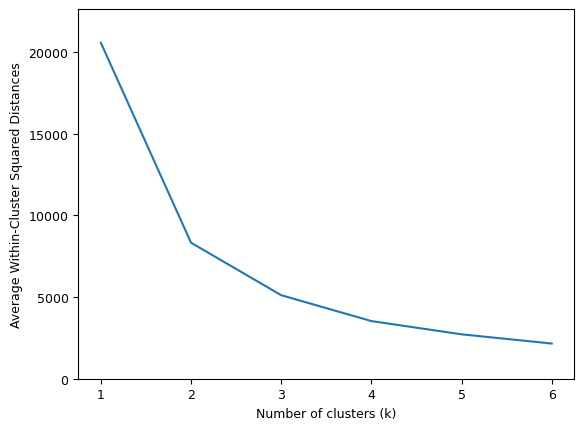

Average within-cluster inertia across k=1–6. The curve bends at 3 and flattens after — independently confirming the cluster count that the Ward dendrogram had already suggested.

**Technique:** elbow method, cross-validating an unsupervised parameter against a second method.

---

## 7. Communication — Cluster Comparison Charts

Grouped bars compare Ward against K-Means cluster membership side by side:

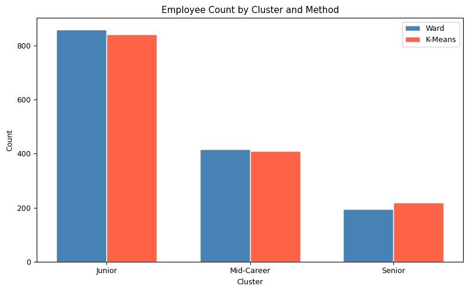

Near-identical bars across two independent algorithms.

Stacked bars then convert cluster membership into the business finding:

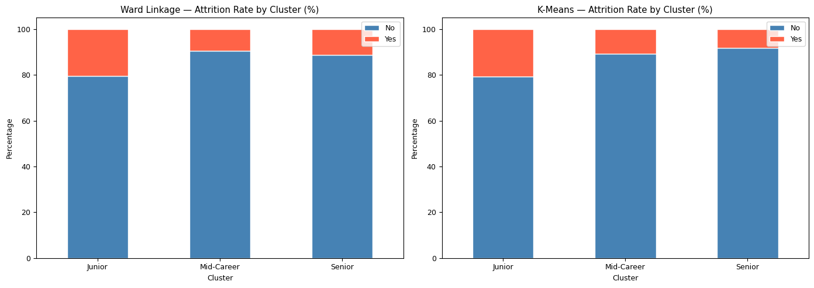

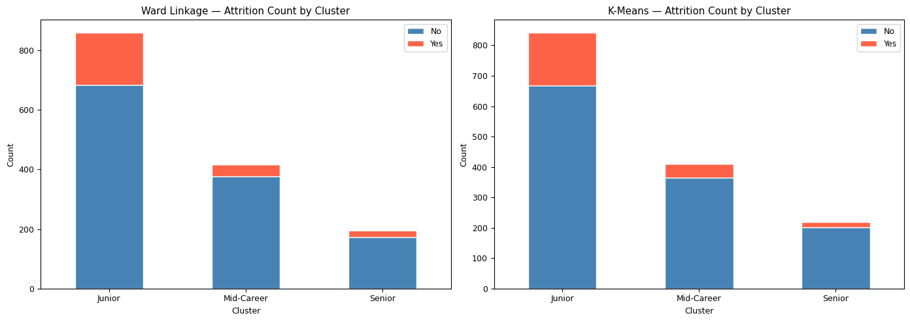

Both rate *and* count are shown deliberately. Rate alone would suggest Junior and Senior are comparable concerns; count reveals Junior carries roughly 176 of the 237 departures. The pair together makes the case that percentage alone would understate.

**Technique:** grouped vs. stacked bar selection, manual bar offsetting for grouped comparison, `normalize=True` for proportional views, rate-and-volume pairing.

---

## 8. Model Evaluation — ROC Curves

Two logistic regression models were trained: a standard 60/40 split, and one on a training set oversampled to 50/50 to correct the class imbalance spotted back in section 1.

| | Standard Split | Oversampled |
|---|---|---|
| Accuracy | 85.9% | 74.8% |
| **Recall** | **36.3%** | **67.2%** |
| Precision | 67.3% | 35.2% |
| AUC | 0.84 | 0.81 |

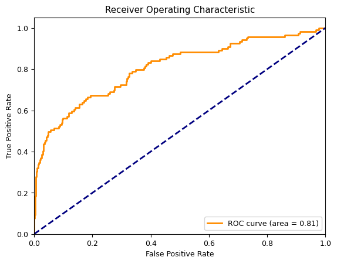

Both models have effectively equivalent AUC (0.84 vs 0.81), meaning their underlying ranking ability is comparable. The steep initial rise confirms the oversampled model captures true positives at low false-positive cost. Given that a missed flight risk costs more than a false alarm, the model that nearly doubles recall wins, and the curve is the evidence.

**Technique:** ROC/AUC plotting, using curve shape to separate ranking quality from threshold effects.

---

## 9. Deployment — Risk Summary

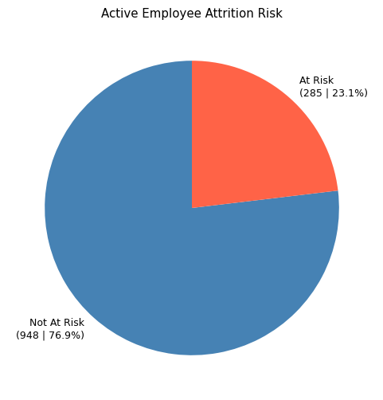

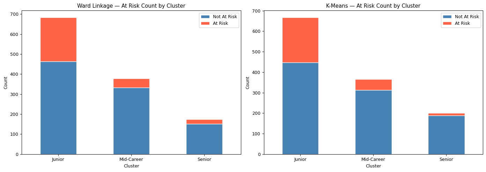

Final output for a business audience: of 1,233 currently active employees, 285 (23%) exceed the 0.5 risk threshold — and the breakdown by cluster shows the same Junior concentration the clustering track found independently. Two analytical approaches converging on one conclusion.

---

## Repository Contents

- `Attrition_at_IBM.ipynb` — main analysis notebook
- `images/` — exported figures

## References

- Hees, J. (2015, August 26). *SciPy hierarchical clustering and dendrogram tutorial.* Jörn's Blog. — dendrogram truncation approach used in §3
- Shmueli, G., Bruce, P. C., Yahav, I., Patel, N. R., & Lichtendahl, K. C. (2020). *Data Mining for Business Analytics: Concepts, Techniques, and Applications in Python.* John Wiley & Sons.
- Dyerly, R. (2025, January 21). *The myth of replaceability: Preparing for the loss of key employees.* SHRM Executive Network.
